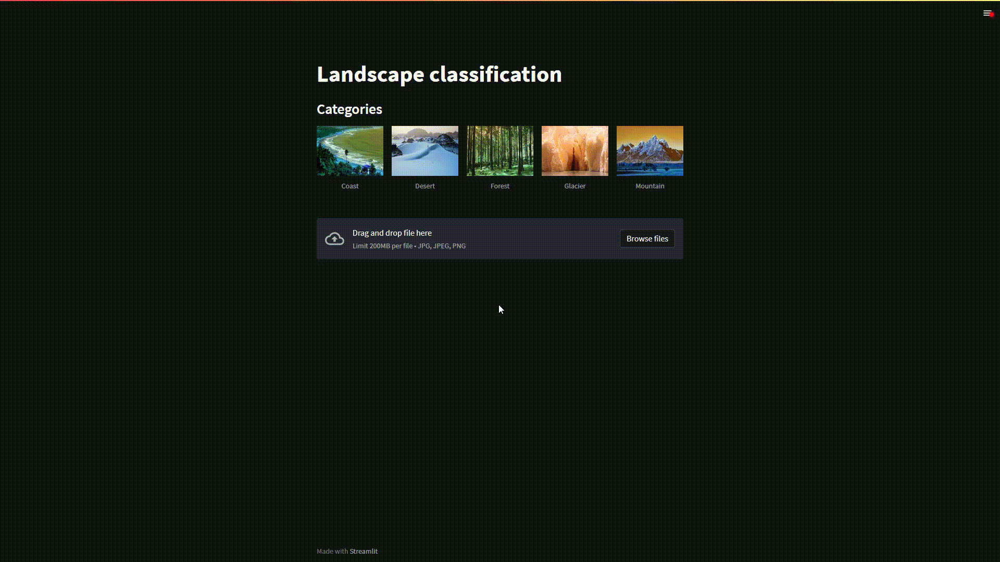

# Landscape classification

## Overview

This is an image classification app that uses a CNN to classify images of landscapes into 5 different categories: "Coast", "Desert", "Forest", "Glacier" and "Mountain". The model was trained on a dataset of 10,000 images from [Kaggle](https://www.kaggle.com/datasets/utkarshsaxenadn/landscape-recognition-image-dataset-12k-images?datasetId=2707450&sortBy=voteCount).



## Installation & Run

1. Clone the repository
```sh
git clone https://github.com/your-username/your-repository
```
2. Install the required packages
```sh
pip install -r requirements.txt
```
3. Run
```sh
streamlit run main.py
```
